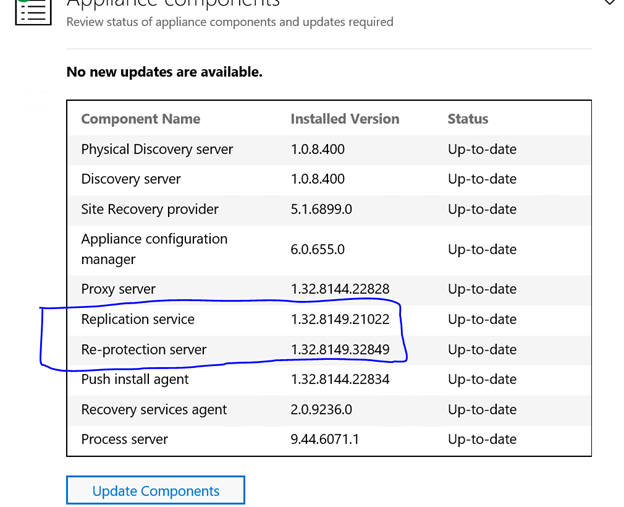

# Azure Migrate application credential rotation guide

## Disclaimer

Guidance in this document applies only in relation to the mitigation steps necessary for the issue disclosed in the [CVE](https://msrc.microsoft.com/update-guide/vulnerability/CVE-2021-42306) and detailed in [Microsoft Security Response Center blog](https://aka.ms/CVE-2021-42306-AAD). Do not use this guidance as general credential rotation procedure.

## Overview

Follow the remediation steps below only if you are using or previously used the [preview version of VMware to Azure DR experience in ASR](https://docs.microsoft.com/en-us/azure/site-recovery/vmware-azure-architecture-preview) which was [launched](https://azure.microsoft.com/en-us/updates/vmware-dr-preview-with-asr/) on Aug 30, 2021. For any other Azure Site Recovery users and/or scenarios, there is no further action needed.

## Remediation steps

1. Login to the Azure portal and navigate to Recovery Services vault.
2. Identify the vault that you created while enabling ASR for the VMware to Azure DR preview experience. 
3. Go to Site Recovery vault > Site Recovery Infrastructure > ASR Replication Appliances (Preview) page. Please check if you have an active appliance running. If you do not, please go to ‘OPTION 1’ below. If you do have an active appliance, you have the following two options:  

### OPTION 1

1. Go to Site Recovery tab and click on ‘View all VMs’ to see the list of replicated VMs.
1. Right click on each VM and select ‘Disable Replication’ to disable replication.  
1. [Re-enable](https://docs.microsoft.com/en-us/azure/site-recovery/vmware-azure-set-up-replication-tutorial-preview) replication using a new vault.
1. Delete the impacted AAD apps associated with the old vault.

### OPTION 2 (if Option 1 is not feasible for you)

1. The following script should be run sequentially on only one appliance at a time. If you run the script simultaneously on more than 1 appliance in the vault, it will cause replication to stop. 
   
2. To execute the mitigation steps, you need to have
	1. An administrator account to login to the appliance server
	2. Permissions to register AAD App(s). [Learn more](https://docs.microsoft.com/en-us/azure/site-recovery/deploy-vmware-azure-replication-appliance-preview#prerequisites)
	3. Permissions for all the certificates in the key vault
	4. Read access to the subscription.
3. Login to the server hosting Azure Site Recovery appliance
4. Install [.Net version 4.7.2](https://dotnet.microsoft.com/download/dotnet-framework/net472) in the appliance. Please restart your machine right away if prompted. Click ‘OK’ on rest of the dialog boxes until your machine restarts. This is a pre-req for the script to run.
5. Download the scripts from the following locations to the appliance server: [https://aka.ms/ASR_AADApp_CertRotation_Script](https://aka.ms/ASR_AADApp_CertRotation_Script).
6. Open PowerShell as an Administrator.
7. Navigate to the directory where the script is downloaded and then execute the script by running the following command: **`.\AadCertRollover.ps1`**
8. When prompted, log in with your Azure user account. The user account should have permissions listed in Step#1 of Option#2.
9.  Wait for the script to get successfully executed. If you run into an error, please request assistance from Microsoft support by logging a case. Please use the phrase [AAD app cert rollover] in the issue summary and choose the following options:
   1. Service type: Azure Site Recovery
   2. Problem type: I need help with the on-prem components used as part of Site Recovery
   3. Problem subtype: I need help with ASR replication appliance or Configuration server 
10. In case you do not have any VMs protected or in the process of being protected, you can skip the below steps.
11. On successful completion of the AadCertRollover.ps1, please wait for 12 hours before we start execution of phase 2 of the mitigation.
12. Upgrade appliance components by following steps illustrated in [Upgrade Mobility Service and appliance components - preview - Azure Site Recovery | Microsoft Docs](https://docs.microsoft.com/en-us/azure/site-recovery/upgrade-mobility-service-preview#upgrade-appliance)
13. Verify ‘Replication service’ version is >= 1.32.8149.21022 and ‘Re-protection server’ version is >= 1.32.8149.32849
    
14. Open the command prompt as administrator and change directory to “C:\Program Files\Microsoft On-Premise to Azure Replication agent”
15. Run the following command to resynchronize all VMware protected VMs:
**RcmReplicationAgent.exe -setresyncrequiredforallreplications**

1. Once Resynchronization is triggered, you will see message “Resync marked for all the replications that were in protected state.” If you run into an error, please request assistance from Microsoft support by logging a case. Use the summary phrase, service type, problem type, and problem subtype details listed in step 12 while logging the case.
1. Change the directory to “C:\Program Files\Microsoft Azure to On-Premise Reprotect agent”. cd “C:\Program Files\Microsoft Azure to On-Premise Reprotect agent”
1. Run the following command to resynchronize all protected Azure VMs.
   
   **RcmReprotectAgent.exe -setresyncrequiredforallreplications.**
   
2. If you run into an error, please request assistance from Microsoft support by logging a case. Use the summary phrase, service type, problem type, and problem subtype details listed in step 12 while logging the case.
3. Once Resynchronization is triggered, you will see message “Resync marked for all the replications that were in protected state.”
4. If this command fails, then please request assistance from Microsoft support by logging a case. Use the summary phrase, service type, problem type, and problem subtype details listed in step 12 while logging the case.
